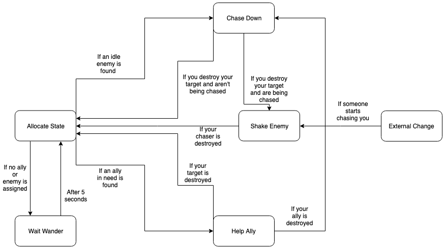

# Final Submission
## Instructions
This repo uses Git LFS. If you don't have Git LFS you wont clone the occlusion culling data and might need to bake that file again, which takes forever. Clone the repo and run the unity files. If you want to just get a build of the project, use this link (https://drive.google.com/drive/folders/14-rAFAB9LGmUJ0SiW835FgkhwPP0SM9v?usp=sharing) to google drive for a mac and windows build.
## How it works
This project atempts to replicate the Battle over Coruscant in Star Wars III in Unity using Boid Steering Behaviours and Ai Statemachines. The project plays like a movie that you can't interact with, however because of the procedural nature of it you will never get the same experience more than once. The scene starts like the movie does with two jedi star fighter flying over a Republican star destroyer. The yellow ship is following a basic path that starts at the republican destroyer and ends in the hangar bay of General Grievious' ship. The red ship just follows the yellow one with the Arrive behaviour. As the two ship nose dive into the ongoing battle. A large group of republican Arc-170 ship can be seen flying towards the enemy control ship. Out of all the ship, one starts of as the "leader" whilst the others aren't. The leader assigns all others a number which decides their position in the approach formation. The first two non leaders are assigned the numbers 1 and -1 the second two are assigned 2 and -2 and so on. The numbers are then used to calculate an offset position from the leader. This ends up looking like a large spread out V formation. These ship fly towards the number of approaching vulture droids. These droids just choose a random Arc 170 ship to approach. Once the ships are close enough, the ai statemachine kicks in, which is essentially the same for both the Arc170 ships and the vulture droids.

The logic of the statemachines is fairly straight forward, however it looks complex when run. Essentially, the statemachine has 4 states each ship can be in, aswell as one state specifically desiigned to allocate the next state of the ship. The first state is the ChaseDown state, which makes the ship chase down an assigned ship. It does this with a combination of the arrive and pursue behaviour. It enables pursue if the target is far away and switches to arrive when it is close enough. This means that the ship will get close to the target but never reach it. If its target is destroyed, the ship checks if it is currently being chased itself. If so it switches its current state into the EscapeEnemy state. Else it switches to the allocateState state which will assign a new objective.

The second behaviour is the ShakeEnemy state lets the ship attempt to flee from his chaser. This behaviour works with a combination of two NoiseWander behaviours. One decides the vertial axis of movement and one decides the horizontal axis wander. I used two wonders to be able to controll the intensity of the vertical which should be relatively smooth, whilst the horizontal wander should be more spuratic. If the chasing enemy is destoyed the state changes into the allocateState state.

The third state is the helpAlly state which lets ships help allies in need. This behaviour is very similar to the first behaviour where the ship just chases down the the chasing enemy of an ally in need. If the ally the ship is destoyed, the state switches to Chase down the enemy. If the enemy chasing the ally is destroyed the ship is allocated a new state.

The last state is the Wait wonder state, which is just a buffer state that is used if all other ship are busy and no allies need help. This state is rarely used, however is crucial to have the ship working in an infinite loop. This behaviour is the same and the Shake enemy behaviour in essence. The only difference is that the state automatically changes into allocateState after 5 seconds to attempt to assign a new role.

The allocate State state is the state that cause me the most grieve. This state only has an state Enter function which switches to a new State by the end of the function. To start with the state create to lists of all ally and enemy ships. It also has to null gameObjects called NewEnemy and NewAlly. The function loops through all enemies to check if anyof them are doing nothing. If thats the case the new enemy is assigned to that enemy. IT then loops through all allies to check if any of them need help and that no one is helping them. If that is the case it assigns NewAlly to that ally. It then checks if NewEnemy has been assigned. If so, it changes the state to chase down that enemy and changes that enemies state to shake enemy. If NewEnemy hasn't been assigned, it then checks if the NewAlly has been assigned. If so, it changes the ships state to HelpAlly state and lets the enemy chasing the NewAlly know that it is now being chased aswell. If both NewEnemy and NewAlly remain unassigned, it changes the state to waitwander, where the ship will try again in 5 seconds.

If all of that made no sense, hopefull this diagram will clear things up:

## What I am most proud of in the assignment
